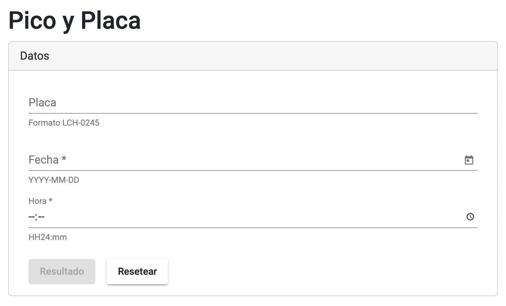

# Pico y Placa 


Este proyecto fue desarrollado con el fin de ayudar a verificar el `Pico y Placa` o tambien llamado `Hoy no Circula` en la ciudad de Quito.



## Comenzando 🚀

Clona o descarga el proyecto del siguiente repositorio: https://github.com/renysh/pico-placa


```
git clone https://github.com/renysh/pico-placa.git
```


Mira **Despliegue** para conocer como desplegar el proyecto.


### Pre-requisitos 📋

Para ejecutar el proyecto se necesita tener instalado lo siguiente:
* [Node.js](https://nodejs.org/en/)


### Instalación 🔧

Ejecutar lo siguiente en la raíz del proyecto:

```bash
npm install
```

## Ejecutando las pruebas ⚙️

Ejecuta `ng test` para ejecutar ls pruebas unitarias vía [Karma](https://karma-runner.github.io).

## Despliegue 📦

Ejecuta `ng serve` para levantar el servidor de desarrollo. 

Navega a la dirección `http://localhost:4200/`.

## Construido con 🛠️

* [Typescript](https://www.typescriptlang.org/docs/)
* [Angular](https://angular.io/docs)
* [Angular Material](https://material.angular.io/guide/getting-started)
* [Karma](https://karma-runner.github.io)
* [Moment.js](https://momentjs.com/docs/)
* [Bootstrap](https://getbootstrap.com/docs/5.2/getting-started/introduction/)


## Autores ✒️

* **René Ortega** - *Desarrollador* - [renysh](https://github.com/renysh)
